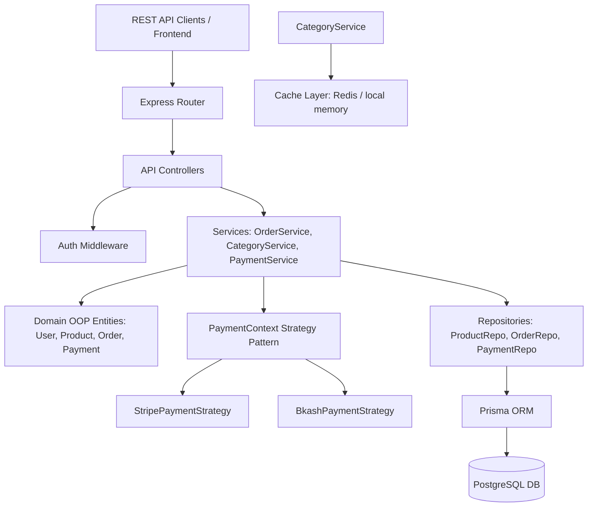
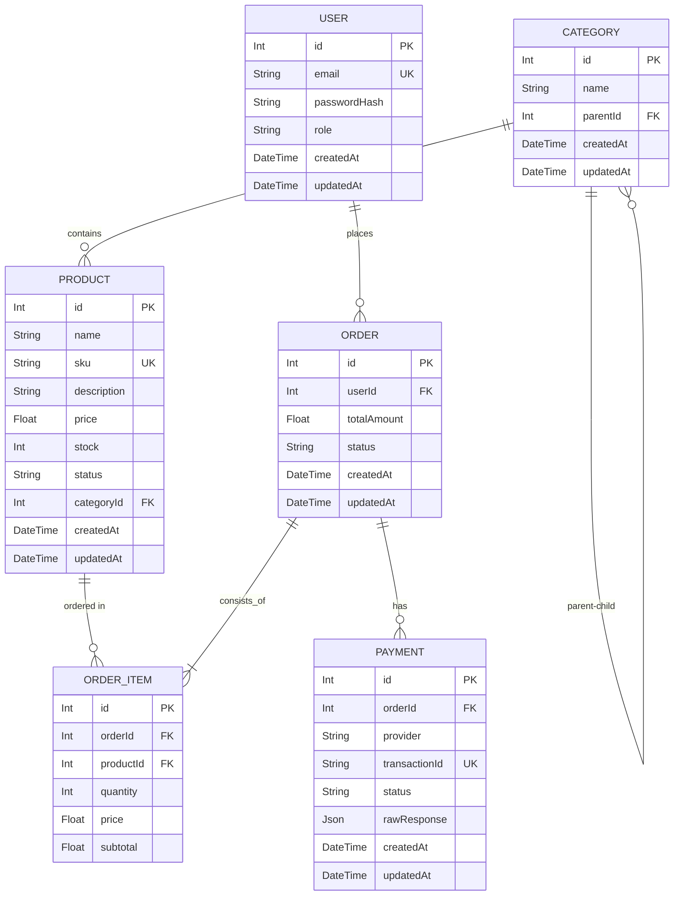
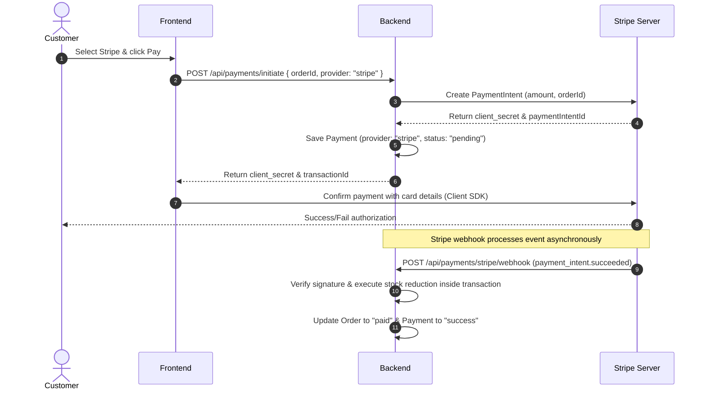
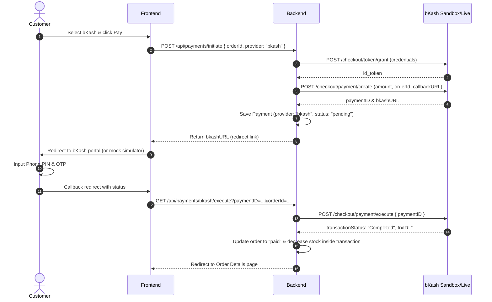

# E-Commerce Ordering & Payment System Documentation

This document describes the system architecture, database schema, payment flows, and API specifications for the E-Commerce Ordering & Payment System.

---

## 1. System Architecture

The backend is architected following clean architecture and Domain-Driven Design (DDD) principles:
- **Domain Layer**: Contains pure OOP domain models (`User`, `Product`, `Order`, `Payment`, `Category`) representing business rules.
- **Repository Layer**: Maps database queries to domain entities using Prisma ORM.
- **Service Layer**: Orchestrates domain behaviors, stock transactions, category DFS tree traversal, and payment strategy execution.
- **Controller/Routing Layer**: Exposes Express REST APIs.
- **Payment Strategy**: A clean Strategy Pattern decouples order logic from specific payment providers.

---

## 2. Entity-Relationship Diagram (ERD)

The database schema utilizes relational mapping, foreign keys, and indexes for performant queries.

---

## 3. Payment Flow Diagrams

### 3.1 Stripe Payment Flow

### 3.2 bKash Payment Flow (Tokenized Checkout)

---

## 4. API Documentation

### 4.1 User Authentication
- **`POST /api/auth/register`**
  - Body: `{ "email": "test@test.com", "password": "password123", "role": "customer" }` (role is optional)
  - Response (217): `{ "message": "User registered successfully", "user": { "id": 1, "email": "test@test.com", "role": "customer" } }`
- **`POST /api/auth/login`**
  - Body: `{ "email": "test@test.com", "password": "password123" }`
  - Response (200): `{ "message": "Login successful", "token": "JWT_TOKEN", "user": { "id": 1, "role": "customer" } }`

### 4.2 Products
- **`GET /api/products`**
  - Query Parameters: `categoryId` (optional)
  - Response (200): List of products.
- **`GET /api/products/:id`**
  - Response (200): Product details.
- **`POST /api/admin/products`** (Admin privileges required)
  - Headers: `Authorization: Bearer <JWT>`
  - Body: `{ "name": "Apple Watch", "sku": "WATCH9", "price": 399.99, "stock": 50, "categoryId": 1 }`
- **`PUT /api/admin/products/:id`** (Admin privileges required)
- **`DELETE /api/admin/products/:id`** (Admin privileges required)

### 4.3 Categories & Recommendations (DFS + Caching)
- **`GET /api/categories`**
  - Returns hierarchical category tree (cached).
- **`POST /api/categories`** (Admin privileges required)
  - Body: `{ "name": "Smartphones", "parentId": 1 }`
- **`GET /api/categories/:id/recommendations`**
  - Performs **DFS traversal** to find products belonging to category `:id` and all nested child categories.

### 4.4 Orders
- **`POST /api/orders`**
  - Headers: `Authorization: Bearer <JWT>`
  - Body: `{ "items": [ { "productId": 1, "quantity": 2 } ] }`
  - Response (217): Order details with deterministic subtotals and totals.
- **`GET /api/orders/mine`**
  - Headers: `Authorization: Bearer <JWT>`
  - Returns all orders belonging to logged-in user.
- **`GET /api/orders/:id`**

### 4.5 Payments (Strategy Pattern)
- **`POST /api/payments/initiate`**
  - Headers: `Authorization: Bearer <JWT>`
  - Body: `{ "orderId": 1, "provider": "stripe" }` or `{ "orderId": 1, "provider": "bkash" }`
  - Response (201): Stripe payment secret / clientSecret OR bKash checkout URL.
- **`GET /api/payments/mine`**
  - Headers: `Authorization: Bearer <JWT>`
  - Returns payment list for the user.
- **`POST /api/payments/stripe/webhook`**
  - Raw event webhook receiver.
- **`GET /api/payments/bkash/execute`**
  - Executes payment. Used as callback landing route.
